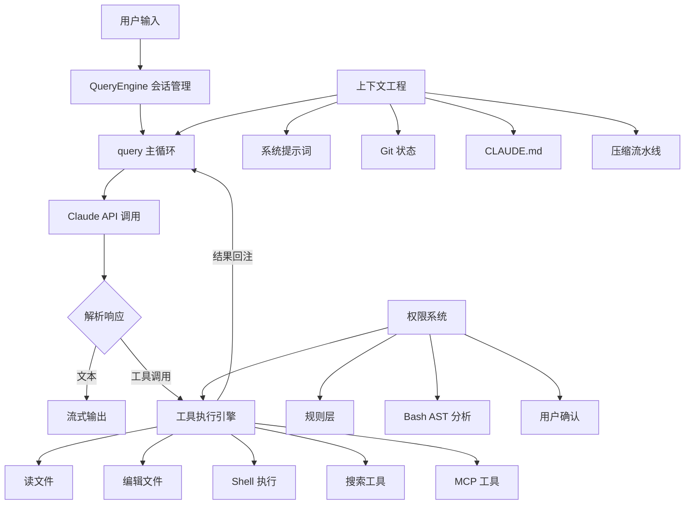

# How Claude Code Works

> Claude Code 源码出来了，赶紧进行分析和学习吧！

[English](./README_EN.md)

**不是读代码笔记，是架构抽象。** 本项目从 Claude Code 的 50 万+ 行 TypeScript 源码中，提炼出 11 篇专题文档 + 架构图，帮你用最短路径理解这个生产级编程 Agent 的设计精髓。

## 从源码中发现的关键设计洞察

> 以下观点均来自对 50 万行源码的实际分析，不是猜测。

### Agent 循环层

- **Agent 循环不是简单的 `while(true)`，而是一个有 7 种 Continue 原因的状态机** —— 包括上下文压缩重试、输出 token 预算升级(4K→64K)、Hook 验证循环等。每种 Continue 路径有独立的恢复逻辑，并且可以被测试断言验证。
- **可恢复的错误会被"扣留"而不是立即暴露** —— `prompt-too-long`、`max-output-tokens` 等错误先压住，内部尝试压缩+重试。如果恢复成功，SDK 调用方永远看不到这个错误。这防止了客户端（如 IDE 插件）因为中间态错误而崩溃。
- **工具在模型还没说完话的时候就已经开始执行了** —— `StreamingToolExecutor` 在模型流式输出的同时解析并预执行工具调用，模型说完时工具可能已经跑完了。利用模型生成 5-30 秒的窗口，隐藏掉约 1 秒的工具延迟。

### 上下文工程层

- **上下文压缩不是"满了就压"，而是 4 级渐进式流水线** —— Snip（裁剪历史）→ Microcompact（去重，几乎零成本）→ Context Collapse（投影式释放，不修改原消息）→ Autocompact（最后手段，fork 子 Agent 做摘要）。每一级都有可能释放足够的 token 使得下一级不需要执行。
- **压缩后会自动恢复最近使用的 5 个文件和所有已调用的 Skill** —— Autocompact 可能让模型"忘记"刚编辑的文件。系统会重新注入最近 5 个文件（每个限 5K token）+ 所有已激活的 Skill（预算 25K token），确保压缩后仍能继续工作。

### 安全层

- **Bash 命令安全检查用的是 tree-sitter AST 分析，不是正则匹配** —— 7 层安全流水线包括：包装器剥离、环境变量过滤、AST 语义分析、23 项静态校验器（含 IFS 注入、控制字符检测）、路径约束、sed 专项漏洞检查、权限规则匹配。连 sed 都有独立的注入防护，因为 sed 有领域特有的攻击面。
- **权限确认对话框背后有三路竞速** —— UI 确认、ML 分类器自动审批（~100ms）、Hook 自定义校验同时启动，先完成的获胜。但有 200ms 防抖保护，防止键盘弹跳导致的误批准。用户触碰对话框的瞬间，分类器结果被丢弃。

### 工程细节层

- **66+ 工具不会全部出现在每次构建中** —— 使用 Bun 编译器的 `feature()` 宏做编译期死代码消除（不是运行时 if-else）。内部专用工具在外部构建中完全消失，不增加包体积也不会泄露。
- **启动速度快的秘密是 9 阶段并行初始化** —— MDM 读取和 Keychain 预取在模块加载时就并行启动；非关键任务（用户信息、文件计数、模型能力检测）推迟到首次渲染之后。关键路径仅约 235ms。
- **API 529 过载重试区分前台和后台** —— 前台操作（用户对话、Agent 执行、压缩）会重试，后台任务（摘要、预测）直接放弃。防止后台任务在级联故障时放大网关压力。

## 系统架构

## 文档目录

### 快速入门
- **[10 分钟读懂 Claude Code](./docs/quick-start.md)** — 全部内容的浓缩版，适合快速了解

### 专题深入

| # | 文档 | 内容 | 关键词 |
|---|------|------|--------|
| 1 | [概述](./docs/01-overview.md) | 解决什么问题、技术栈、设计原则、目录结构 | 定位、架构 |
| 2 | [系统主循环](./docs/02-agent-loop.md) | Agent Loop 的完整实现：双层生成器、流式处理、停止条件 | **最核心章节** |
| 3 | [上下文工程](./docs/03-context-engineering.md) | 上下文构建、4 级压缩流水线、Token 预算管理 | 压缩、提示词 |
| 4 | [工具系统](./docs/04-tool-system.md) | 66+ 工具、执行流水线、并发控制、MCP 集成 | 工具、扩展 |
| 5 | [代码编辑策略](./docs/05-code-editing-strategy.md) | 搜索替换 vs 整文件重写、低破坏性编辑哲学 | 编辑、安全 |
| 6 | [权限与安全](./docs/06-permission-security.md) | 5 层纵深防御、Bash AST 分析、注入防护 | 安全、权限 |
| 7 | [用户体验设计](./docs/07-user-experience.md) | Ink/React TUI、流式输出、Vim 模式 | UX、终端 |
| 8 | [最小必要组件](./docs/08-minimal-components.md) | 构建 coding agent 的最小组件集、渐进增强路线 | 复刻、学习 |
| 9 | [Hooks 与可扩展性](./docs/09-hooks-extensibility.md) | 23+ Hook 事件、5 种 Hook 类型、PermissionRequest 深度解析 | Hooks、定制 |
| 10 | [多 Agent 架构](./docs/10-multi-agent.md) | 子 Agent、协调器模式、Swarm 团队 | 多 Agent |
| 11 | [记忆与技能系统](./docs/11-memory-skills.md) | 4 种记忆类型、18+ 内置技能、跨会话学习 | 记忆、技能 |

## 关键数据

| 指标 | 数值 |
|------|------|
| 源码总行数 | 512,000+ |
| TypeScript 文件数 | 1,884 |
| 内置工具 | 66+ |
| Hook 事件类型 | 23+ |
| 内置技能 | 18+ |
| 权限防御层数 | 5 层 |
| 压缩流水线级数 | 4 级 |
| 启动初始化步骤 | 9 阶段 |

## 阅读建议

**如果你只有 10 分钟：**
→ 读 [快速入门](./docs/quick-start.md)

**如果你想理解核心原理：**
→ 按顺序读 [主循环](./docs/02-agent-loop.md) → [上下文工程](./docs/03-context-engineering.md) → [工具系统](./docs/04-tool-system.md)

**如果你想自己实现一个：**
→ 读 [最小必要组件](./docs/08-minimal-components.md)，然后去看 [claude-code-from-scratch](https://github.com/Windy3f3f3f3f/claude-code-from-scratch)

**如果你关注安全：**
→ 读 [权限与安全](./docs/06-permission-security.md) + [代码编辑策略](./docs/05-code-editing-strategy.md)

**如果你想定制 Claude Code：**
→ 读 [Hooks 与可扩展性](./docs/09-hooks-extensibility.md) + [记忆与技能系统](./docs/11-memory-skills.md)

## 相关项目

- **[claude-code-from-scratch](https://github.com/Windy3f3f3f3f/claude-code-from-scratch)** — 从零实现 Claude Code 核心功能的最小化实现与教程

## 贡献

欢迎提 Issue 和 PR！如果你发现分析有误或有更好的理解角度，非常欢迎讨论。

## License

MIT
