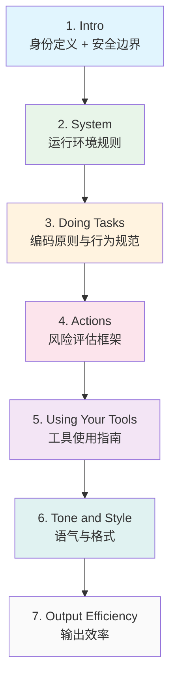
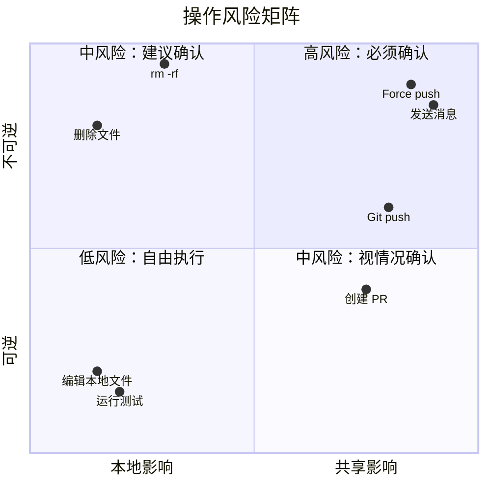
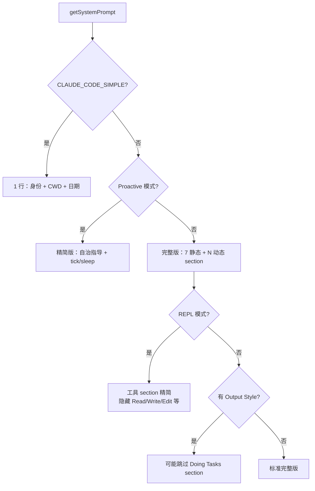

# 第 14 章：系统提示词的设计哲学

> 系统提示词不只是"告诉模型该做什么"——它是产品行为的蓝图，每一句话都对应一个真实的用户体验问题。

## 为什么需要专门分析提示词内容？

[第 3 章](./03-context-engineering.md)详细讲解了系统提示词的**构建机制**——section 如何组装、缓存边界如何划分、上下文如何注入。但这只回答了"怎么做"的问题。

本章关注的是更本质的问题：**每个 section 为什么这样写？它解决了什么真实的用户体验问题？用了什么提示词工程技巧？**

Claude Code 的系统提示词经过了大量 A/B 测试、用户反馈和模型行为观察的迭代打磨。分析它的设计，对构建自己的 Agent 系统有直接的参考价值。

关键文件：`src/constants/prompts.ts`（~915 行）、`src/constants/cyberRiskInstruction.ts`

## 14.1 分层架构：从身份到细节

系统提示词的 7 个静态 section 形成了一个**从抽象到具体的递进结构**：



这个递进结构不是偶然的，它遵循了一个重要的提示词工程原则：**先建立身份和约束框架，再填充具体的行为指导**。模型在处理后续指令时，会以前面建立的框架作为理解上下文。如果把工具使用细节放在身份定义之前，模型可能会把自己理解为"一个使用工具的程序"而非"一个帮助用户的 Agent"。

每个 section 之间存在**依赖关系**：Actions section 的"检查用户确认"依赖 System section 建立的"权限模式"概念；Tools section 的"优先使用专用工具"依赖 Doing Tasks section 建立的"最小化原则"。

## 14.2 身份与边界：三句话定义一个 Agent

Intro section（`getSimpleIntroSection`）是整个系统提示词中最短的部分，只有三句话：

```typescript
// src/constants/prompts.ts — getSimpleIntroSection()
return `
You are an interactive agent that helps users with software engineering tasks.
Use the instructions below and the tools available to you to assist the user.

${CYBER_RISK_INSTRUCTION}
IMPORTANT: You must NEVER generate or guess URLs for the user unless you are
confident that the URLs are for helping the user with programming.`
```

但这段代码只展示了默认情况。实际上，这句身份定义是**条件化的**——当用户配置了 Output Style 时，表述会动态调整：

```typescript
// src/constants/prompts.ts — getSimpleIntroSection()
function getSimpleIntroSection(outputStyleConfig: OutputStyleConfig | null): string {
  return `
You are an interactive agent that helps users ${
    outputStyleConfig !== null
      ? 'according to your "Output Style" below, which describes how you should respond to user queries.'
      : 'with software engineering tasks.'
  } Use the instructions below and the tools available to you to assist the user.
  ...`
}
```

当 Output Style 存在时，身份定义从"帮助用户完成软件工程任务"变为"按照 Output Style 描述的方式回应用户"。这意味着 Agent 的**核心使命会随配置动态切换**——从面向任务的编码助手变为面向风格的通用助手。这与后面 14.8 节提到的 `keepCodingInstructions` 标志配合：当 Output Style 接管时，Doing Tasks section 的编码原则可能被整体跳过，形成一个连贯的"人格切换"。

三句话，三个层次：

**第一句：身份定义**。注意用词是 **"interactive agent"** 而非 "assistant" 或 "AI"。这个选择是刻意的——"agent" 暗示主动性和工具使用能力，"interactive" 强调与用户的协作关系。相比之下，"assistant" 会让模型倾向于被动等待指令。

**第二句：安全边界**。`CYBER_RISK_INSTRUCTION` 被定义在一个独立文件 `src/constants/cyberRiskInstruction.ts` 中，文件头有醒目的治理注释：

```typescript
// src/constants/cyberRiskInstruction.ts
/**
 * IMPORTANT: DO NOT MODIFY THIS INSTRUCTION WITHOUT SAFEGUARDS TEAM REVIEW
 *
 * This instruction is owned by the Safeguards team and has been carefully
 * crafted and evaluated to balance security utility with safety. Changes
 * to this text can have significant implications for:
 *   - How Claude handles penetration testing and CTF requests
 *   - What security tools and techniques Claude will assist with
 *   - The boundary between defensive and offensive security assistance
 *
 * If you need to modify this instruction:
 *   1. Contact the Safeguards team
 *   2. Ensure proper evaluation of the changes
 *   3. Get explicit approval before merging
 */
```

这是一个**"治理即代码"**的典型案例：安全策略不是写在文档里的抽象规定，而是直接嵌入代码中，通过代码审查流程来强制执行。文件头注释充当了"代码级别的审批流程声明"。

**第三句：具体故障预防**。禁止生成或猜测 URL——这不是一条通用安全规则，而是针对一个**观察到的具体失败模式**：模型会"幻觉"出看起来合理但实际不存在的 URL，用户点击后要么 404，要么更糟——被导向钓鱼网站。通过在最顶层明确禁止，将这个高频问题消灭在源头。

### 设计洞察

三句话覆盖了三个递增的具体性层次：抽象身份 → 领域边界 → 具体故障预防。这种模式值得学习：**不要试图在身份定义中塞入所有规则，而是用最少的话建立最关键的框架**。

## 14.3 反模式接种：告诉模型"不要做什么"

`getSimpleDoingTasksSection()` 是提示词工程中最有启发性的部分之一。它的核心策略是**反模式接种**——明确列出模型不应该做的事情，而不是仅仅描述期望行为。

### 三条反过度工程子弹

```
- Don't add features, refactor code, or make "improvements" beyond what was asked.
  A bug fix doesn't need surrounding code cleaned up. A simple feature doesn't
  need extra configurability. Don't add docstrings, comments, or type annotations
  to code you didn't change. Only add comments where the logic isn't self-evident.

- Don't add error handling, fallbacks, or validation for scenarios that can't happen.
  Trust internal code and framework guarantees. Only validate at system boundaries
  (user input, external APIs). Don't use feature flags or backwards-compatibility
  shims when you can just change the code.

- Don't create helpers, utilities, or abstractions for one-time operations. Don't
  design for hypothetical future requirements. The right amount of complexity is
  what the task actually requires. Three similar lines of code is better than a
  premature abstraction.
```

为什么需要这么详细的负面清单？因为 LLM 有一个根深蒂固的倾向：**过度帮忙**。模型在训练中学到"好的代码"应该有完善的错误处理、抽象层、注释和类型注解。但在实际的编码辅助场景中，这种"好心"往往是有害的——用户只想修一个 bug，模型却顺手重构了半个文件。

每条规则都针对一个**具体的过度工程模式**：

| 反模式 | 模型的自然倾向 | 规则的纠正 |
|--------|--------------|-----------|
| Scope creep | 修 bug 时顺手清理周围代码 | "A bug fix doesn't need surrounding code cleaned up" |
| 防御性编程 | 为不可能的场景加 try-catch | "Trust internal code and framework guarantees" |
| 过早抽象 | 看到两行相似代码就提取函数 | "Three similar lines is better than a premature abstraction" |
| 过度注释 | 给每个函数加 docstring | "Don't add docstrings to code you didn't change" |
| 过度验证 | 在内部函数里校验参数类型 | "Only validate at system boundaries" |

### 为什么负面清单比正面期望更有效？

对比两种提示词写法：

- **正面期望**："写简洁的代码，只做必要的修改" —— 模型认为加注释和错误处理是"必要的"
- **负面清单**："不要给你没修改的代码加 docstring" —— 模型无法将加 docstring 重新定义为"必要"

负面清单之所以更有效，是因为它**消除了模型的自我合理化空间**。正面指令（"be concise"）留下了大量解释余地；负面指令（"don't add X"）则是明确的禁令，模型很难找到绕过的理由。

### 其他关键反模式

Doing Tasks section 中还散布着其他针对性的行为纠正：

- **"不要提议修改你没读过的代码"**——防止模型基于文件名猜测内容
- **"不要给出时间估计"**——模型对工程复杂度的估计通常不准确，给出时间估计会误导用户
- **"向后兼容 hack 禁令"**——禁止 `_unused` 变量重命名、`// removed` 注释等安抚性操作
- **"诊断失败原因再换方案"**——防止模型在遇到错误时不分析原因就换方向

每一条都对应了团队在实际使用中观察到的具体问题。这不是理论上的提示词设计，而是**经验驱动的行为校准**。

## 14.4 爆炸半径框架：教模型推理风险

`getActionsSection()` 是整个系统提示词中最长的单体 section，也是设计最精妙的部分。它没有简单罗列"不能做 X、不能做 Y"，而是**教给模型一个决策框架**。

### 核心框架：可逆性 × 影响范围

```
Carefully consider the reversibility and blast radius of actions.
Generally you can freely take local, reversible actions like editing
files or running tests. But for actions that are hard to reverse,
affect shared systems beyond your local environment, or could otherwise
be risky or destructive, check with the user before proceeding.
```

这段话建立了一个**二维风险评估模型**：



### 四类高风险操作

系统提示词将风险操作分为四个清晰的类别，每类配有具体示例：

1. **破坏性操作**：删除文件/分支、drop 数据库表、`rm -rf`
2. **难以逆转的操作**：`force-push`、`git reset --hard`、修改 CI/CD 管道
3. **对外可见的操作**：push 代码、创建/关闭 PR、发送消息
4. **内容上传**：上传到第三方工具（可能被缓存或索引）

### 授权范围原则

```
A user approving an action (like a git push) once does NOT mean that
they approve it in all contexts. Authorization stands for the scope
specified, not beyond.
```

这条规则解决了一个微妙的问题：模型可能会将一次性授权泛化。用户说"好的，push 这个分支"，模型不应该认为以后所有的 push 都不需要确认。

### "Measure twice, cut once"

整个 section 以木工谚语"量两次，切一次"结尾——这不仅是给模型的指令，也是向读者传达设计意图：**在不确定时，停下来确认的成本远低于撤销一个错误操作的成本**。

### 框架 vs 规则

这个 section 的设计哲学值得强调：它**教的是决策框架，而非穷举规则**。如果只列出"不能 force push、不能 rm -rf、不能发消息"，模型遇到规则列表之外的新情况（比如调用一个 API 删除云资源）就不知道该怎么做。但有了"可逆性 × 影响范围"的框架，模型可以自行推理：删除云资源 = 不可逆 + 共享影响 = 必须确认。

## 14.5 工具偏好层级：专用工具优于 Bash

`getUsingYourToolsSection()` 建立了一个明确的工具使用层级。

### 显式映射表

```
- To read files use Read instead of cat, head, tail, or sed
- To edit files use Edit instead of sed or awk
- To create files use Write instead of cat with heredoc or echo redirection
- To search for files use Glob instead of find or ls
- To search the content of files, use Grep instead of grep or rg
```

为什么 Claude Code 要费力地提供专用工具，然后再在提示词中强制模型使用它们？答案不在于技术能力——`cat` 和 `Read` 工具的底层功能几乎相同。关键在于**用户体验**：

```
Do NOT use the Bash to run commands when a relevant dedicated tool is
provided. Using dedicated tools allows the user to better understand
and review your work.
```

专用工具的优势：

| 维度 | Bash (`cat file.ts`) | Read 工具 |
|------|---------------------|-----------|
| 用户审查 | 只看到命令字符串 | 显示文件路径和读取范围 |
| 权限控制 | 所有 bash 命令统一权限 | 读取 vs 写入可分别控制 |
| 输出格式 | 原始终端输出 | 带行号的结构化输出 |
| 错误处理 | 可能静默失败 | 明确的错误消息 |
| 并行能力 | 需要手动 `&` 和 `wait` | 原生并行调用 |

### 并行工具调用指导

```
You can call multiple tools in a single response. If you intend to call
multiple tools and there are no dependencies between them, make all
independent tool calls in parallel.
```

这条指导看似简单，实际上在教模型做**依赖分析**：先判断哪些操作是独立的（可以并行），哪些存在依赖（必须串行）。这直接影响了用户感知的响应速度——并行读取 5 个文件比串行快 5 倍。

### 搜索工具层级

对于代码搜索，提示词建立了另一个层级：

```
For simple, directed codebase searches use Glob or Grep directly.
For broader codebase exploration, use the Agent tool with subagent_type=Explore.
```

简单搜索 → 专用搜索工具 → 子 Agent 搜索——随着任务复杂度递增，使用更重量级的工具。这防止了两种极端：用子 Agent 做简单的文件查找（浪费资源），或者用 Grep 做需要多轮探索的复杂搜索（效果不好）。

### 条件分支：REPL 模式与嵌入式搜索工具

Using Tools section 并非对所有模式一成不变，源码中有两个重要的条件分支：

**REPL 模式**（`isReplModeEnabled()`）：当 REPL 模式激活时，Read/Write/Edit/Glob/Grep/Bash/Agent 等工具被隐藏（由 REPL 自身的脚本环境提供），整个 Using Tools section 被精简为仅保留任务管理工具（TaskCreate/TodoWrite）的指导。"优先使用专用工具而非 Bash"的规则在 REPL 模式下无意义——REPL 自带的 prompt 会说明如何从脚本中调用这些工具。

**嵌入式搜索工具**（`hasEmbeddedSearchTools()`）：Anthropic 内部构建版本将 `find`/`grep` 命令别名为内嵌的 `bfs`/`ugrep`，并移除了独立的 Glob/Grep 工具。此时，提示词中关于"用 Glob 替代 find、用 Grep 替代 rg"的映射条目会被跳过，因为 Bash 中的 `find`/`grep` 已经是优化过的版本。

```typescript
const embedded = hasEmbeddedSearchTools()
const providedToolSubitems = [
  `To read files use Read instead of cat, head, tail, or sed`,
  `To edit files use Edit instead of sed or awk`,
  `To create files use Write instead of cat with heredoc or echo redirection`,
  // 仅当没有嵌入式搜索工具时才包含
  ...(embedded ? [] : [
    `To search for files use Glob instead of find or ls`,
    `To search the content of files, use Grep instead of grep or rg`,
  ]),
  ...
]
```

这两个条件分支体现了同一个设计原则：**提示词中只指导模型使用它实际拥有的工具**。推荐一个不存在的工具只会导致混乱。

## 14.6 内外有别：分层提示词变体

Claude Code 的系统提示词并非对所有用户完全相同。通过 `process.env.USER_TYPE === 'ant'` 条件分支，内部用户（Anthropic 员工）和外部用户看到不同的提示词。

### 注释写作规则

外部用户的提示词中没有关于代码注释的详细指导。内部用户则有 3 条精确的注释规则：

```
// 仅内部用户可见（@[MODEL LAUNCH] 标记）

1. Default to writing no comments. Only add one when the WHY is non-obvious.
2. Don't explain WHAT the code does — well-named identifiers already do that.
3. Don't remove existing comments unless you're removing the code they describe.
```

这些规则带有 `@[MODEL LAUNCH]` 标记——意味着它们是**模型版本感知的**：

```typescript
// @[MODEL LAUNCH]: Update comment writing for Capybara — remove or
// soften once the model stops over-commenting by default
```

这条注释揭示了一个重要事实：**不同模型版本有不同的行为倾向，提示词需要随之校准**。当前模型（代号 Capybara）倾向于过度注释，所以需要强力抑制；未来的模型可能不再有这个问题，这些规则就可以移除。

### 虚假声明缓解

另一个内部专用 section 是虚假声明（False Claims）缓解：

```typescript
// @[MODEL LAUNCH]: False-claims mitigation for Capybara v8
// (29-30% FC rate vs v4's 16.7%)

`Report outcomes faithfully: if tests fail, say so with the relevant
output; if you did not run a verification step, say that rather than
implying it succeeded. Never claim "all tests pass" when output shows
failures...`
```

注释中的数据（v8 的 29-30% FC 率 vs v4 的 16.7%）显示了 Anthropic 对模型行为的**量化追踪**。提示词不是凭感觉写的，而是对应着具体的质量指标。当 FC 率升高时，添加更强的缓解提示词；当模型改善后，逐步放宽。

### 输出风格的两套方案

外部用户看到的是简洁的"Output efficiency"：

```
IMPORTANT: Go straight to the point. Be extra concise.
If you can say it in one sentence, don't use three.
```

内部用户看到的是长达 15 行的"Communicating with the user"，包含：

- **倒金字塔**结构（先说结论，再给细节）
- **语义回溯**禁令（不要让读者需要重新解析前面的句子）
- **数值长度锚点**（工具调用之间的文本 ≤25 words，最终回复 ≤100 words）

数值锚点的注释尤其有趣：

```typescript
// Numeric length anchors — research shows ~1.2% output token reduction
// vs qualitative "be concise". Ant-only to measure quality impact first.
```

"≤25 words"比"be concise"能多节省 1.2% 的输出 token——这个微小的差异在 Anthropic 的规模上意味着显著的成本节省。但他们先在内部用户上验证质量影响，再考虑推广到外部。

### `@[MODEL LAUNCH]` 标记

这个模式贯穿整个 prompts.ts：

```typescript
// @[MODEL LAUNCH]: Update the latest frontier model.
const FRONTIER_MODEL_NAME = 'Claude Opus 4.6'

// @[MODEL LAUNCH]: Update the model family IDs below.
const CLAUDE_4_5_OR_4_6_MODEL_IDS = { ... }

// @[MODEL LAUNCH]: Add a knowledge cutoff date for the new model.
function getKnowledgeCutoff(modelId: string): string | null { ... }
```

每次发布新模型时，工程师搜索 `@[MODEL LAUNCH]` 就能找到所有需要更新的位置。这是**提示词的版本发布工程**——将提示词视为需要维护和发布的产品组件，而非一次性写好的静态文本。

## 14.7 语气的微观工程

`getSimpleToneAndStyleSection()` 看似只是一些格式规范，实际上每条规则都针对一个观察到的具体问题。

### 禁止 Emoji

```
Only use emojis if the user explicitly requests it.
```

为什么？原因有三层：（1）Claude Code 运行在终端中，很多终端对 emoji 的渲染支持不佳，可能显示为方块、乱码或宽度计算错误导致排版混乱；（2）在专业的软件工程场景中，emoji 会让输出看起来不够严肃，降低用户对工具的信任感；（3）模型在训练中学到了大量"友好助手"风格的 emoji 使用习惯，如果不明确禁止，几乎每条回复都会带上 emoji。但这条规则留了后门："unless the user explicitly requests it"——如果用户明确要求，说明他们的终端支持且个人偏好允许。

### file_path:line_number 格式

```
When referencing specific functions or pieces of code include the pattern
file_path:line_number to allow the user to easily navigate to the source.
```

这是一个**输出协议**的设计。大多数代码编辑器和终端都支持点击 `file:line` 格式直接跳转到对应位置。如果模型只说"在 prompts.ts 的 getActionsSection 函数中"，用户还需要手动搜索；但 `src/constants/prompts.ts:255` 可以直接点击打开。

### 工具调用前不加冒号

```
Do not use a colon before tool calls. Text like "Let me read the file:"
followed by a read tool call should just be "Let me read the file." with a period.
```

这条规则修复了一个 UI 问题：在 Claude Code 的界面中，工具调用会被渲染为独立的 UI 组件（如折叠面板），而非内联文本。如果模型写"让我读取文件："后面跟一个工具调用，用户看到的是一个以冒号结尾的悬空句子，下方是一个视觉上独立的工具调用卡片——冒号暗示后面还有内容要跟，但实际上后面是空的，造成"句子被截断"的错觉。改用句号则形成一个完整的陈述句，即使工具调用不可见或延迟出现，文本本身也是自洽的。这是一个典型的"提示词为 UI 渲染服务"的例子。

### GitHub 链接格式

```
When referencing GitHub issues or pull requests, use the owner/repo#123
format so they render as clickable links.
```

在支持 GitHub 集成的终端中，`anthropics/claude-code#100` 会自动渲染为可点击的链接。这种格式也比完整 URL 更简洁易读。

## 14.8 条件复杂度：同一产品的多张面孔

上一节（14.6）分析了**用户身份**（内部/外部）带来的提示词差异。但用户身份只是条件维度之一。系统提示词的最终形态由多个维度共同决定：

- **用户身份**：内部用户 vs 外部用户（`USER_TYPE`）
- **运行模式**：交互模式、Proactive 自治模式、REPL 模式、极简模式（`CLAUDE_CODE_SIMPLE`）
- **配置选项**：Output Style、语言偏好、MCP 服务器
- **功能开关**：Feature flags（`PROACTIVE`、`KAIROS`、`CACHED_MICROCOMPACT` 等）

本节聚焦**运行模式**这一维度——它对系统提示词的影响最为剧烈，甚至会完全替换整个提示词结构。

Claude Code 的系统提示词不是一个固定的字符串，而是一个**根据运行模式动态组装的模板**。

### Proactive 模式：完全不同的 Agent

当 Proactive 模式激活时，整个系统提示词被替换为一个精简版本：

```typescript
if (proactiveModule?.isProactiveActive()) {
  return [
    `\nYou are an autonomous agent. Use the available tools to do useful work.
    ${CYBER_RISK_INSTRUCTION}`,
    getSystemRemindersSection(),
    await loadMemoryPrompt(),
    envInfo,
    getLanguageSection(settings.language),
    getMcpInstructionsSection(mcpClients),
    getScratchpadInstructions(),
    getFunctionResultClearingSection(model),
    SUMMARIZE_TOOL_RESULTS_SECTION,
    getProactiveSection(),
  ].filter(s => s !== null)
}
```

注意差异——交互模式的 7 个静态 section 被**完全替换**为一组不同的 section：

| Section | 交互模式 | Proactive 模式 |
|---------|---------|---------------|
| 身份定义 | "interactive agent" | "autonomous agent" |
| Doing Tasks | 完整的编码原则 | 无 |
| Actions | 完整的风险框架 | 无 |
| Using Tools | 详细工具指南 | 无 |
| Tone/Efficiency | 语气和输出规范 | 无 |
| System Reminders | 作为 System section 的一部分 | 独立 section：`<system-reminder>` 标签说明 + 自动摘要提示 |
| Memory Prompt | 动态注入 | 动态注入（`loadMemoryPrompt()`） |
| Env Info | 动态注入 | 动态注入（CWD、日期、平台等） |
| Language | 动态注入 | 动态注入 |
| MCP Instructions | 动态注入 | 条件注入（受 `isMcpInstructionsDeltaEnabled` 控制） |
| Scratchpad | 动态注入 | 动态注入（临时文件目录指导） |
| Function Result Clearing | 动态注入 | 独立 section：告知模型旧工具结果会被自动清理 |
| Summarize Tool Results | 无独立 section | 独立 section：提醒模型及时记录重要工具结果 |
| 自治指导 | 无 | 完整的 tick/sleep/pacing 系统（`getProactiveSection()`） |

几个值得注意的设计选择：

- **Function Result Clearing** 和 **Summarize Tool Results** 在交互模式下通过动态 section 注册机制按需加载，但在 Proactive 模式下被**硬编码**进提示词数组。这是因为自治 Agent 长时间运行，上下文膨胀更快，主动清理和摘要更为关键。
- **Scratchpad Instructions** 为 Agent 提供一个会话级的临时目录，避免污染用户项目。对于长时间自治运行的 Proactive Agent，这尤其重要。
- Proactive 模式完全移除了 Doing Tasks、Actions、Using Tools 等交互导向的 section，因为自治 Agent 不需要"检查用户确认"或"优先使用专用工具"——它的行为由 `getProactiveSection()` 中的 pacing/sleep/bias-toward-action 规则全权指导。

Proactive Agent 有自己独特的行为指导：

- **Tick 机制**：通过 `<tick>` 标签保持 Agent 存活，附带时间戳
- **Sleep 工具**：Agent 必须调用 Sleep 而非空闲等待，否则浪费 API 调用
- **终端焦点感知**：`terminalFocus` 字段告诉 Agent 用户是否在看——不在时更自主，在看时更协作
- **"Bias toward action"**：优先行动而非询问确认，与交互模式的"measure twice, cut once"形成对比

这种模式切换说明了一个重要的设计决策：**不同的交互范式需要完全不同的行为指导**。试图用一套提示词同时覆盖交互和自治模式，只会导致两种模式都表现不佳。

### CLAUDE_CODE_SIMPLE：极简模式

```typescript
if (isEnvTruthy(process.env.CLAUDE_CODE_SIMPLE)) {
  return [
    `You are Claude Code, Anthropic's official CLI for Claude.\n\n` +
    `CWD: ${getCwd()}\nDate: ${getSessionStartDate()}`,
  ]
}
```

一行系统提示词——只有身份、工作目录和日期。这可能用于调试或性能测试，也说明了系统提示词的**最小可行集**：模型只需要知道"我是谁"和"我在哪"就能开始工作。

### 其他变体



- **REPL 模式**：隐藏直接文件操作工具（因为 REPL 自带），Using Tools section 大幅精简
- **Output Style 模式**：如果用户配置了自定义输出风格，Doing Tasks section 的编码原则可能被跳过（由 `keepCodingInstructions` flag 控制）
- **非交互模式**：移除某些仅在交互场景有用的提示（如 `! command` 快捷方式提示）

## 14.9 设计启示：构建自己的 Agent 提示词

从 Claude Code 系统提示词的设计中，可以提炼出 7 条可操作的设计原则：

### 1. 负面清单优于正面期望

| 正面期望 | 负面清单 |
|---------|---------|
| "写简洁的代码" | "不要给你没修改的代码加 docstring" |
| "做最小化的修改" | "不要为不可能的场景加错误处理" |
| "注意安全" | "不要生成或猜测 URL" |

**为什么有效**：正面期望给模型留下自我合理化的空间（"加注释是让代码更好"）。负面清单消除了这个空间。

**何时使用**：当你观察到模型反复出现某个不良行为时，直接将其列为禁令，而非试图用正面描述来间接引导。

### 2. 教框架，而非穷举规则

Actions section 的"可逆性 × 影响范围"框架让模型能推理从未见过的场景。

**何时使用**：当可能的操作空间太大、无法穷举时。给模型一个评估维度（如风险矩阵），让它自行判断新情况。

### 3. 从抽象到具体递进

身份 → 环境规则 → 行为原则 → 风险框架 → 工具指南 → 格式细节。

**为什么有效**：模型在处理后续 section 时，以前面建立的框架作为理解上下文。如果先讲工具细节再讲身份，模型可能会错误地将自己理解为"工具执行器"。

### 4. 模型版本感知校准

不同模型版本有不同的行为倾向。Claude Code 通过 `@[MODEL LAUNCH]` 标记和 `USER_TYPE` 分支来管理这些差异。

**何时使用**：当你发现升级模型后出现新的行为问题时，添加针对性的校准提示词，并标记其适用的模型版本，方便未来清理。

### 5. 缓存感知设计

将提示词分为静态（全局可缓存）和动态（会话特定）部分，用明确的边界标记分隔。

**何时使用**：当你的 Agent 有大量用户时。静态部分的全局缓存可以显著降低 API 成本。从第一天就设计好这个分界线，比事后重构容易得多。详见[第 3 章 3.2 节](./03-context-engineering.md#_32-系统提示词的构建)。

### 6. 治理即代码

通过代码注释声明所有权（`CYBER_RISK_INSTRUCTION`）、通过命名约定传达风险（`DANGEROUS_uncachedSystemPromptSection`）、通过条件分支实现灰度发布。

**何时使用**：当你的提示词涉及安全、合规或其他高敏感领域时。将审批流程嵌入代码仓库，而非依赖口头约定或外部文档。

### 7. 工具偏好显式化

不要假设模型知道在 `cat` 和 `Read` 工具之间应该选择哪个。通过显式的映射表（X instead of Y）告诉它。

**何时使用**：当你的 Agent 有多个功能重叠的工具时。模型倾向于使用它在训练数据中见过最多的方式（如 `cat`），而非你提供的专用工具。

---

**总结**：Claude Code 的系统提示词是一个经过大量迭代打磨的产品设计产物。它的每一句话都不是随意添加的——背后要么是观察到的模型行为问题，要么是量化实验的结果，要么是安全团队的审慎评估。理解这些设计选择，是构建高质量 Agent 系统的重要参考。
