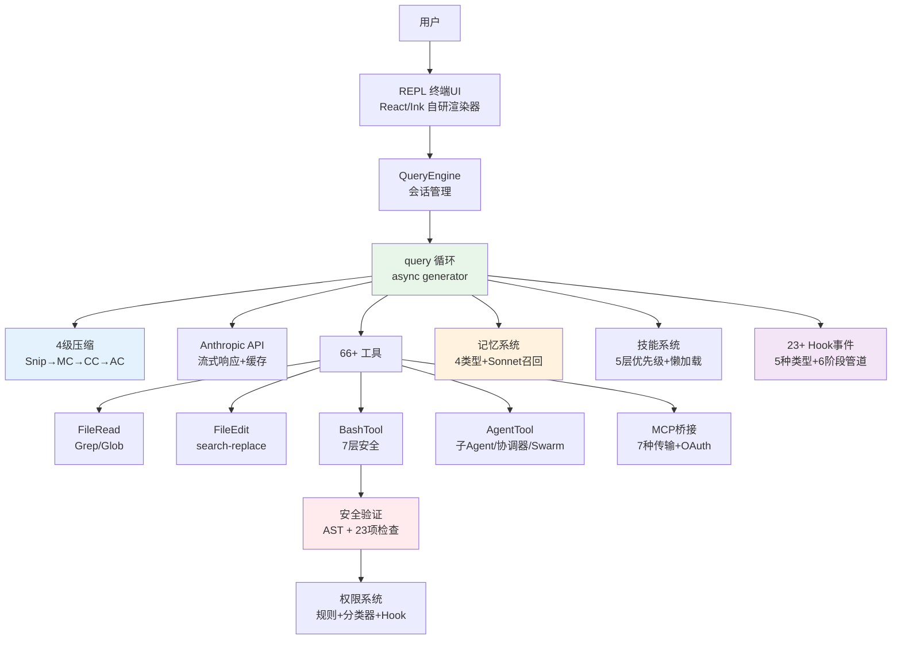

# 10 分钟读懂 Claude Code

> 本文是 Claude Code 源码分析的浓缩版。每个主题都附有深入阅读链接。

## Claude Code 是什么

Claude Code 是 Anthropic 的 CLI 编程 Agent。它不是代码补全工具，而是一个**受控工具循环 Agent**——能理解代码库、编辑文件、执行命令、管理 git 的自主编程助手。

技术栈：TypeScript + Bun + React/Ink（自研终端渲染器） + Anthropic API。源码约 512K+ 行。

关键技术选型背后的思考：
- **Bun** 不只是快——它的 `feature()` 宏提供编译时死代码消除，让内部功能在外部发布版中被物理删除
- **React/Ink（自研）** 不是上游 Ink——Claude Code 维护了 251KB 的定制渲染器，支持 Flexbox 布局、虚拟滚动、对象池
- **Zod** 出现在三个安全边界：工具输入校验、Hook 输出解析、配置验证

启动经过精心优化，分 **9 个阶段**，关键路径仅约 **235ms**：并行预取（MDM + Keychain）、幂等初始化、延迟非关键任务（用户信息/文件计数推迟到首帧后）、懒加载重依赖（OpenTelemetry ~400KB+ 在 Trust Dialog 后才加载）。

> 深入阅读：[概述](./01-overview.md)

---

## 核心：Agent Loop

Claude Code 的灵魂是一个 `while(true)` 循环：

```
用户输入 → 组装上下文 → 调用模型 → 模型决策
  ↓
  有工具调用？ → 执行工具 → 注入结果 → 继续循环
  ↓
  无工具调用？ → 返回文本响应 → 结束
```

实现为 `async function*` 异步生成器，支持真正的流式处理。采用双层架构：

- **QueryEngine**（外层）：管理对话生命周期、持久化、预算检查
- **query()**（内层）：管理单次循环、API 流式、工具执行、错误恢复

query() 有 **7 个 Continue Sites**，分别处理：正常工具循环、PTL 恢复、输出 Token 升级、反应式压缩等。每种 Continue Site 对应一种故障恢复路径——这就是为什么用 Claude Code 时很少遇到报错，不是没有错误，而是大部分都被内部消化了。

核心设计亮点：
- **错误扣留策略**——可恢复的错误不暴露给调用者，自动修复后继续
- **工具预执行**——模型还在生成输出时，已完成的工具调用参数就立即开始执行，把约 1 秒的工具延迟藏在模型生成的 5-30 秒窗口里
- **StreamingToolExecutor**——边流式解析边并发执行，只读工具自动并行

> 深入阅读：[系统主循环](./02-agent-loop.md)

---

## 上下文工程

每次 API 调用的上下文由三部分组成：

1. **系统提示词**：Agent 身份、行为指引、工具描述
2. **系统上下文**：Git 状态（分支、暂存、最近提交）
3. **用户上下文**：CLAUDE.md 项目指令、当前日期

当对话变长，**4 级压缩流水线**逐级启动：

```
Snip（剪裁）→ Microcompact（微压缩）→ Context Collapse（折叠）→ Autocompact（全量摘要）
```

每级成本和效果不同，按需逐级触发。Autocompact 在 Token 使用达到约 87% 时触发，fork 子 Agent 生成对话摘要。

**压缩后恢复机制**——压缩不只是删信息，还会主动恢复关键上下文：
- 自动重新读取最近编辑的 **5 个文件**（每个 ≤5K tokens），防止模型忘记刚刚在干什么
- 重新激活活跃的技能上下文（≤25K tokens）
- 重置 Context Collapse 标记

**提示词缓存策略**——系统提示词和历史消息通过缓存断点标记，避免每次 API 调用都重新计算。系统还能自动检测缓存断裂（cache miss 率突增），归因到是 CLAUDE.md 变更、对话压缩还是工具结果过大导致的。

> 深入阅读：[上下文工程](./03-context-engineering.md)

---

## 工具系统

Claude Code 包含 **66+ 内置工具**，全部统一为 `Tool` 接口：

| 核心工具 | 功能 |
|---------|------|
| BashTool | Shell 命令执行（最复杂，7 层安全验证） |
| FileEditTool | search-and-replace 精确编辑 |
| FileReadTool | 文件读取（支持图片/PDF/Jupyter） |
| GrepTool | ripgrep 驱动的内容搜索 |
| AgentTool | 派生子 Agent（支持 worktree 隔离） |

并发规则：**只读工具并行，写入工具串行**。通过 `isReadOnly()` 和 `isConcurrencySafe()` 判断。工具输出超过 100K 字符时自动落盘，模型只拿到摘要和文件路径。

### MCP 集成

MCP 协议扩展支持 **7 种传输**（stdio/SSE/HTTP/WebSocket/SDK/IDE/Proxy），第三方工具无缝集成。关键设计：

- **Tool-to-MCP 能力映射**——内置工具的能力自动映射到 MCP 协议
- **连接状态机**——完整的 MCP 生命周期管理（初始化 → 就绪 → 断开 → 重连）
- **OAuth 2.0 + PKCE**——3 阶段认证流程，支持自动 Token 轮换（30 秒超时）
- **多作用域配置**——MCP 服务器可在项目级、用户级、团队级分别配置

> 深入阅读：[工具系统](./04-tool-system.md)

---

## 代码编辑策略

核心理念：**低破坏性编辑**。

- **FileEditTool**（首选）：search-and-replace，只修改目标文本
  - 唯一性约束：`old_string` 必须在文件中唯一
  - 抗幻觉：不存在的代码会导致编辑失败
  - Token 高效：只需发送修改点附近的上下文
- **FileWriteTool**（创建新文件）：全文件覆盖写入

编辑前必须先读取文件——不是提示词建议，而是代码层面的强制检查（`hasReadFileInSession` 标志位）。

> 深入阅读：[代码编辑策略](./05-code-editing-strategy.md)

---

## 权限与安全

纵深防御，5 层保护：

```
Trust Dialog → 权限模式 → 权限规则匹配 → Bash 安全验证(7层) → 用户确认
```

Bash 安全验证最复杂——tree-sitter AST 分析 + 23 项静态检查，覆盖命令注入、环境变量泄露、Shell 元字符等攻击向量。

权限确认使用**竞速机制**：UI 对话框和 ML 分类器同时运行，第一个完成的决定生效。有 200ms 防误触宽限期。

PermissionRequest Hook 是最强的扩展点——可程序化审批、修改工具输入、动态注入权限规则。

> 深入阅读：[权限与安全](./06-permission-security.md)

---

## 用户体验

Claude Code 使用**自研 Ink 渲染器**（React in Terminal，251KB），实现 Web 级终端 UI：

- Yoga Flexbox 布局
- 虚拟滚动大对话列表
- 对象池内存优化（Char/Style/Hyperlink）
- OSC 8 超链接、鼠标追踪、Kitty 键盘协议
- Vim 模式输入

流式输出全链路基于 async generator，每个 Token 实时渲染。工具调用完全透明——用户能看到每一步操作。

> 深入阅读：[用户体验设计](./07-user-experience.md)

---

## Hooks 与可扩展性

Claude Code 提供 **23+ 种 Hook 事件**，覆盖 8 大类别：工具调用、权限判定、会话管理、Agent 生命周期、压缩、任务、配置、交互。

**五种 Hook 类型**，覆盖从简单脚本到企业服务的所有场景：

| Hook 类型 | 适用场景 | 示例 |
|-----------|---------|------|
| Command | 简单 Shell 命令 | CI 构建检查、日志记录 |
| Prompt | 需要 AI 处理的逻辑 | 自定义 Linter 反馈 |
| Agent | 复杂多步决策 | 安全审计流程 |
| HTTP | 企业 HTTP 服务集成 | 团队审批系统 |
| Callback | 异步回调（asyncRewake） | 等待外部审批后继续 |

**Hook 执行引擎**是一个 6 阶段管道：信任检查 → 匹配器过滤 → 输入构建 → 执行模式分发 → 输出解析 → 事件发射。

**PermissionRequest Hook** 是最强大的扩展点，支持 4 种能力：
- 程序化审批/拒绝（替代用户手动确认）
- 修改工具输入参数（如自动给 `rm` 加 `--dry-run`）
- 动态注入权限规则
- 中断操作并返回自定义消息

> 深入阅读：[Hooks 与可扩展性](./09-hooks-extensibility.md)

---

## 多 Agent 架构

Claude Code 支持三种多 Agent 模式，适用于不同复杂度的任务：

### 子 Agent 模式
通过 AgentTool fork 子任务。支持 4 种执行模式（通用/快速/深度研究/规划），可指定使用 sonnet/opus/haiku 不同模型。**Git Worktree 隔离**——每个子 Agent 可以获得独立的代码副本，避免多 Agent 同时编辑产生冲突。

### 协调器模式（Coordinator）
纯指挥官——协调器**只能分配任务，不能自己读文件、写代码**。强制分工的 6 部分系统提示词确保协调器只做编排。标准 4 阶段工作流：研究 → 综合 → 实施 → 验证。核心原则：**"永远不要基于你自己的发现来写代码"**。

### Swarm 团队模式
命名 Agent 间对等信箱通信。支持 3 种执行后端（Tmux / iTerm2 / InProcess），通过 AsyncLocalStorage 实现上下文隔离。Worker 完成任务后通过 `<task-notification>` XML 格式向发起者汇报结果。

> 深入阅读：[多 Agent 架构](./10-multi-agent.md)

---

## 记忆与技能系统

### 记忆系统

Claude Code 的跨会话学习能力依赖文件化记忆系统（`~/.claude/memory/`）：

- **4 种记忆类型**：user（用户画像）、feedback（行为校正）、project（项目上下文）、reference（外部资源指针）
- **YAML frontmatter 格式**存储，每条记忆是一个独立 `.md` 文件
- **MEMORY.md 索引**维护指针，有双层截断（行数 + 字节数）防止索引膨胀
- **召回机制**：扫描 → 格式化 → **Sonnet 语义相关性评估** → 过滤。不是关键词匹配，而是用 AI 判断哪些记忆和当前任务相关
- **异步预取**：在模型生成输出的同时就开始加载记忆，不阻塞主流程

### 技能系统

技能是可复用的提示词模板 + 工具配置，支持 **5 层优先级加载**（托管 > 项目 > 用户 > 插件 > 内置 > MCP）：

- **9 个始终注册的内置技能** + Feature-gated 技能
- 完整的 frontmatter 元数据：名称、描述、别名、触发条件、允许的工具、模型选择、执行上下文
- **多层提示词替换**：基础目录 → 参数 → 环境变量 → 内联 Shell 执行
- **懒加载**：技能内容在真正调用时才加载，注册时只读 frontmatter
- 支持 inline（当前对话）和 fork（独立子 Agent）两种执行上下文

> 深入阅读：[记忆与技能系统](./11-memory-skills.md)

---

## 从最小到完整

构建 coding agent 的 **7 个最小必要组件**：

1. Prompt Orchestration（提示词编排）
2. Tool Registry（工具注册表）
3. Agent Loop（代理循环）
4. File Operations（文件操作）
5. Shell Execution（Shell 执行）
6. Edit Strategy（编辑策略）
7. CLI UX（命令行交互）

每个组件在最小实现和生产级实现之间有明确的对照——例如，最小版的工具定义只需要名称和执行函数，而 Claude Code 的 `Tool` 接口包含权限检查、输入校验、并发控制等 20+ 个方法。

最小可用版本约 500 行代码。Claude Code 的 512K+ 行覆盖了生产级需求：压缩系统、安全验证、MCP 集成、多 Agent 协调、记忆系统、插件系统等。

从零构建可参考：[claude-code-from-scratch](https://github.com/Windy3f3f3f3f/claude-code-from-scratch)

> 深入阅读：[最小必要组件](./08-minimal-components.md)

---

## 核心架构图



## 关键文件索引

| 文件 | 行数 | 职责 |
|------|------|------|
| `src/query.ts` | 1,728 | 核心查询循环 |
| `src/QueryEngine.ts` | 1,155 | 会话引擎 |
| `src/Tool.ts` | ~400 | 工具接口定义 |
| `src/tools.ts` | ~200 | 工具注册 |
| `src/context.ts` | 190 | 上下文构建 |
| `src/services/api/claude.ts` | 3,419 | API 调用逻辑 |
| `src/services/compact/compact.ts` | 1,705 | 压缩引擎 |
| `src/bootstrap/state.ts` | 1,758 | 全局状态 |
| `src/hooks/` | — | Hook 执行引擎与权限处理 |
| `src/coordinator/` | — | 多 Agent 协调器 |
| `src/memdir/` | — | 记忆系统 |
| `src/skills/` | — | 技能系统 |
| `src/screens/REPL.tsx` | 895KB | 主交互界面 |

---

*本文档基于 Claude Code 源码分析。完整分析文档见项目根目录。*

*项目地址：[how-claude-code-works](https://github.com/Windy3f3f3f3f/how-claude-code-works) | [claude-code-from-scratch](https://github.com/Windy3f3f3f3f/claude-code-from-scratch)*
