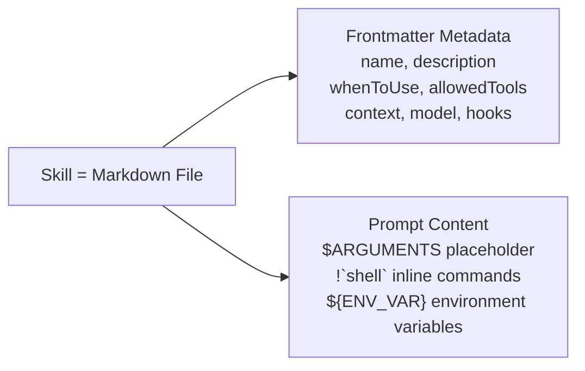
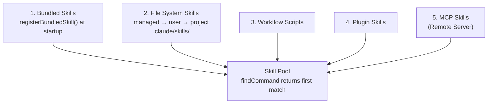
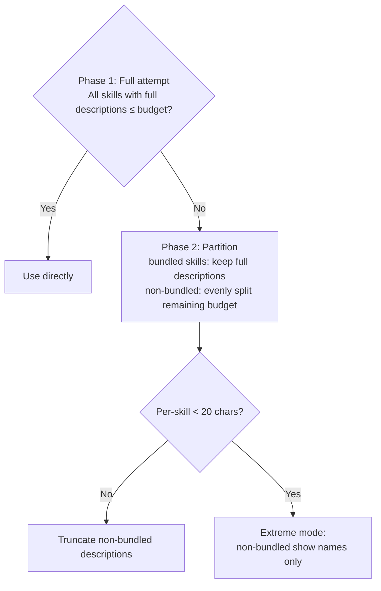
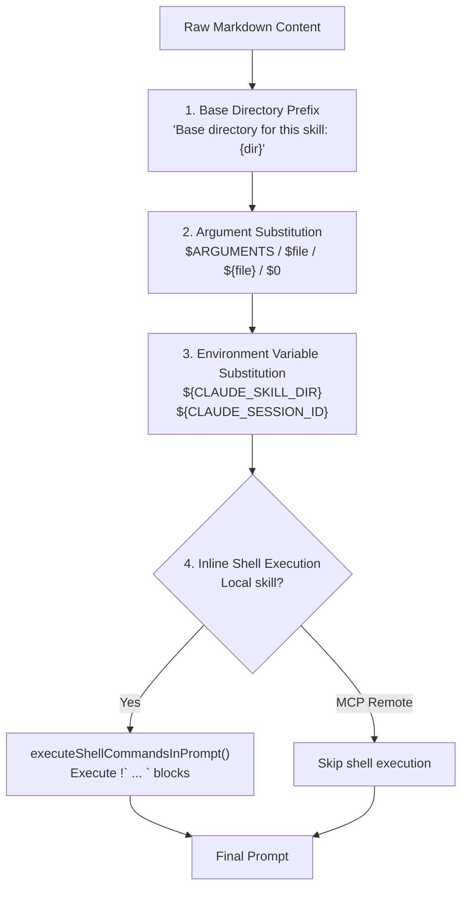
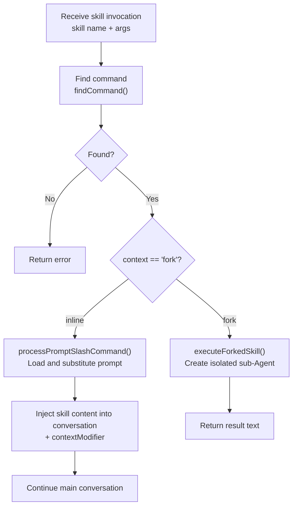
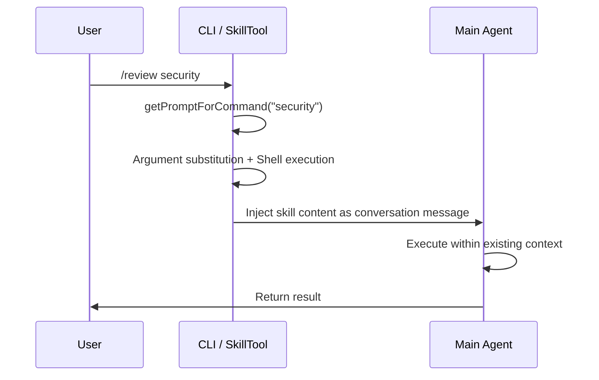
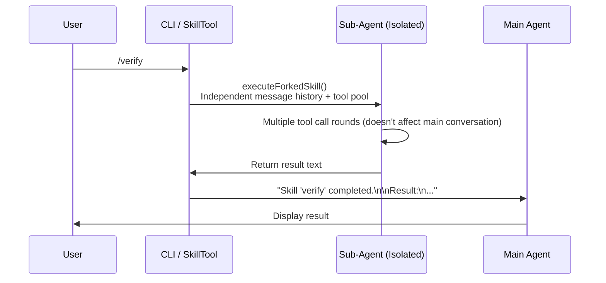

# Chapter 9: Skills System

> Skills are Claude Code's "AI Shell Scripts" — they templatize proven effective prompts so the Agent doesn't have to write the same workflow from scratch every time.

## 9.1 What Are Skills?

Shell scripts automate terminal tasks; skills automate AI tasks. A skill is essentially: **prompt template + metadata + execution context**.



The core problem skills solve: **repetitive AI workflows**. You ask Claude to review code, and every time you have to spell out "check for security vulnerabilities, look at edge cases, watch the naming conventions..." Skills crystallize these proven prompts so they can be written once and reused many times.

### Dual Invocation: The Key Innovation

Unlike traditional chatbot slash commands, Claude Code's skills have two invocation paths:

| Invocation Method | Triggered By | Example |
|---------|--------|------|
| Manual by user | User types `/commit` | User explicitly needs a certain workflow |
| Automatic by model | Model determines the current task needs a skill | User says "help me commit the code," model recognizes intent and calls SkillTool |

**Why is dual invocation a good design?** Traditional slash commands can only be triggered manually — users must know the command name and remember the syntax. This limits usage: if a user doesn't know the `/review` command exists, they'll never use it.

Dual invocation makes skills part of Agent behavior. The model can judge from current context that "now would be a good time to call the review skill" and execute it automatically. Users don't need to remember command names — they just express intent like "can you check if there are any issues with this code," and the model selects the appropriate skill.

At the code level, both paths ultimately converge on the same execution logic: `processPromptSlashCommand()` (for inline skills) or `prepareForkedCommandContext()` (for fork skills).

### Skill File Format

Each skill is a directory containing a `SKILL.md` file:

```
.claude/skills/
  └── review/
      └── SKILL.md        # frontmatter + prompt
      └── templates/       # optional: resource files
          └── report.md
```

Why a directory format instead of a single file? Because skills may need accompanying resource files (templates, configurations, reference docs), referenced via the `${CLAUDE_SKILL_DIR}` environment variable. The directory format makes each skill a self-contained unit.

## 9.2 Skill Sources and Loading

> This section answers: Where do skills come from? What happens at Claude Code startup?

### Six Sources

Skills are loaded from multiple sources. `loadAllCommands()` (`src/commands.ts`) merges them in the following order, and `findCommand()` returns the **first match**, so sources listed earlier have higher priority:



**Bundled skills have the highest priority** — this means you cannot override a built-in skill's name with a project skill. This is a deliberate design: core skill behavior must be predictable and cannot be accidentally replaced by project configuration.

File system skills are deduplicated via `realpath()` to resolve symlinks — files with the same canonical path are treated as the same skill, ensuring correct deduplication across various environments (containers, NFS, symlinks).

### Lazy Loading: Only Load What's Needed

There's an easy-to-miss but important design here: skill content is **not loaded at startup**. The system only preloads frontmatter (name, description, whenToUse); the full Markdown prompt content is read only when the user actually invokes or the model triggers it.

```typescript
// src/tools/SkillTool/prompt.ts
export function estimateSkillFrontmatterTokens(skill: Command): number {
  const frontmatterText = [skill.name, skill.description, skill.whenToUse]
    .filter(Boolean)
    .join(' ')
  return roughTokenCountEstimation(frontmatterText)
}
```

**Why lazy loading?** The system may register dozens of skills. If all were loaded into the context:
- A single skill can have hundreds of lines of prompt — dozens together seriously crowd out context space
- Most skills won't be used in the current session
- Full loading increases startup latency, affecting first response speed

By loading only frontmatter to let the model know "what skills are available" and deferring content loading until actually needed, this achieves **low discovery cost, pay-per-execution**.

## 9.3 Skill Discovery: How Does the Model Know Skills Exist?

> This section answers: How does the skill listing enter the model's view? How does the model decide when to auto-trigger a skill?

### System-Reminder Injection

The skill listing isn't written directly in the system prompt — it's dynamically injected as an **attachment**, ultimately wrapped as a `<system-reminder>` message. What the model sees looks like:

```xml
<system-reminder>
The following skills are available for use with the Skill tool:

- update-config: Use this skill to configure the Claude Code harness via settings.json...
- keybindings-help: Use when the user wants to customize keyboard shortcuts...
- simplify: Review changed code for reuse, quality, and efficiency...
- commit: Create a git commit with a descriptive message...
</system-reminder>
```

This listing is generated by `getSkillListingAttachments()` (`src/utils/attachments.ts`). It has a clever incremental mechanism: **only new skills are sent**. It tracks already-sent skill names per agentId via `sentSkillNames`, avoiding redundant injection.

**Why use an attachment rather than putting it directly in the system prompt?** The system prompt is static, determined at session start. But skills are dynamic — MCP servers may bring new skills online mid-session, plugins may be enabled or disabled. The attachment mechanism lets the skill listing update as the conversation progresses.

### Token Budget: Displaying Skills in Limited Space

The skill listing needs to occupy context space, but space is limited. `formatCommandsWithinBudget()` (`src/tools/SkillTool/prompt.ts`) implements a three-phase budget allocation algorithm:

**Budget calculation**: `1% × context window tokens × 4 chars/token`, approximately 8KB for a 200K context.



**Why are bundled skills never truncated?** Bundled skills represent Claude Code's core capabilities (`/commit`, `/simplify`, `/debug`, etc.). Users expect these skills to always be discoverable. Even if many custom skills are installed causing budget pressure, the discoverability of core functionality must not be sacrificed. This is a deliberate "core functionality first" design trade-off.

Each skill description also has a hard cap: `MAX_LISTING_DESC_CHARS = 250` characters, preventing any single skill's long description from crowding out others.

### whenToUse: Guiding Model Auto-Triggering

The `whenToUse` field is the key to skills being automatically discovered by the model. It appears in the skill listing, and the model uses it to judge "does the current scenario warrant calling this skill."

Bundled skills showcase an excellent writing pattern — **positive triggers + negative exclusions**:

```
TRIGGER when: code imports `anthropic`/`@anthropic-ai/sdk`/`claude_agent_sdk`,
  or user asks to use Claude API, Anthropic SDKs, or Agent SDK.
DO NOT TRIGGER when: code imports `openai`/other AI SDK,
  general programming questions...
```

Good `whenToUse` should:
- **Describe user intent, not user wording**: "When the user needs to review code quality" is better than "When the user says review"
- **Include negative conditions**: Helps the model distinguish similar scenarios and reduce false triggers
- **Be specific rather than vague**: "When the user has modified multiple files and wants to check before committing" is better than "When the user needs help"

Note that these trigger instructions are **documentary** — the model judges on its own based on the descriptions, not automatic triggers. The model may miss or misjudge, but this is a pragmatic design: compared to building a complex rules engine, having the model understand natural language descriptions is already good enough.

## 9.4 Frontmatter and Prompt Processing

> This section answers: What can you write in a skill file? What processing does the prompt go through before execution?

### Frontmatter Fields

Skill files are Markdown + YAML frontmatter. Here are all supported fields:

| Category | Field | Description |
|------|------|------|
| **Basic** | `name` | Display name (defaults to directory name) |
| | `description` | Skill description (influences model auto-trigger judgment) |
| | `when-to-use` | Auto-trigger condition description |
| | `argument-hint` | Argument hint (displayed in help and Tab completion) |
| | `arguments` | Named argument list (e.g., `[file, mode]`, maps to `$file`, `$mode`) |
| **Execution** | `context` | `inline` (default) or `fork`, determines execution isolation level |
| | `allowed-tools` | Tool whitelist (restricts which tools the skill can use) |
| | `model` | Model override (`"inherit"` = inherit from parent) |
| | `effort` | Effort level: `quick` / `standard` / integer |
| | `agent` | Agent type used when forking |
| | `shell` | Shell type for inline shell blocks |
| **Visibility** | `paths` | gitignore-style path patterns (only show when working under matching paths) |
| | `user-invocable` | `false` hides from user `/name` direct invocation |
| | `disable-model-invocation` | `true` prevents model auto-triggering |
| **Extension** | `hooks` | Skill-level hook definitions (see [9.8](#98-extension-mechanisms-and-design-insights)) |

A few notable field designs:

**`paths` field**: Conditional visibility. `parseSkillPaths()` parses gitignore-style path patterns, making the skill visible to the model only when working under matching paths. For example, a React component skill can set `paths: ["src/components/**"]` and won't appear in the skill listing when editing backend code.

**`model` field**: `"inherit"` is parsed as undefined, meaning use the current session model. If the main session model has a suffix (e.g., `[1m]` for thinking budget), the suffix is preserved when overriding.

**`hooks` parsing**: Validated through Zod schema. Invalid hook definitions **only log warnings but don't prevent loading** — a malformed hook should not make the entire skill unusable.

### Prompt Substitution Pipeline

Skill content undergoes multiple layers of substitution at execution time (`getPromptForCommand()`), each solving a specific problem:



**Step 1 — Base directory prefix**: If the skill has an associated directory (`skillRoot`), a path is inserted at the prompt's beginning, letting the prompt reference relative path resources.

**Step 2 — Argument substitution**: `substituteArguments()` handles multiple argument formats:
- `$ARGUMENTS`: Replaced with the entire argument string
- `$file` / `${file}`: Replaced with named arguments (mapped from the frontmatter's `arguments` field)
- `$0` / `$1`: Replaced by positional index
- `$ARGUMENTS[0]`: Indexed access
- If the prompt has **no placeholders at all**, arguments are automatically appended at the end (`ARGUMENTS: ...`)

**Step 3 — Environment variable substitution**: `${CLAUDE_SKILL_DIR}` is replaced with the skill's directory path (backslashes auto-converted to forward slashes on Windows), `${CLAUDE_SESSION_ID}` replaced with the current session ID.

**Step 4 — Inline shell execution**: Skill Markdown can embed shell commands in the `` !`command` `` format, which are run and their output replaces the original text:

```markdown
Current branch: !`git branch --show-current`
Recent commits: !`git log --oneline -5`
```

All embedded shell commands are executed **in parallel** (`Promise.all`), with permission checks before each command. MCP skills from remote untrusted servers skip shell execution and `${CLAUDE_SKILL_DIR}` substitution — this is an explicit check on a security-critical path, analyzed in detail in [Section 9.6](#96-security-and-trust-model).

## 9.5 Execution Model: Inline vs Fork

> This section answers: How are skills executed? What's the difference between the two execution modes?

### Execution Flow Overview

Whether the user manually types `/commit` or the model calls via SkillTool, the core execution path is the same:



**The convergence of both entry paths** is an important design detail. When the user types `/commit -m "fix bug"`, the CLI parses the slash command syntax and calls `processPromptSlashCommand()`. When the model calls via SkillTool, `SkillTool.call()` likewise ultimately calls `processPromptSlashCommand()` (inline) or `prepareForkedCommandContext()` (fork) — **the same skill behaves identically regardless of how it's triggered**. This eliminates the risk of behavior inconsistency between the two paths.

### Inline Mode (Default)

The skill's prompt is injected as a message into the current conversation, and the model continues execution within the existing context:



The key mechanism in inline mode is the **contextModifier**. After processing the result from `processPromptSlashCommand()`, `SkillTool.call()` constructs a `contextModifier` function that modifies the execution context in subsequent turns:

- If the skill specified `allowedTools`, append to `alwaysAllowRules` (auto-authorize these tools)
- If the skill specified `model`, override the model used in subsequent turns
- If the skill specified `effort`, override thinking depth

This means a skill doesn't just inject a prompt — it can **change the Agent's subsequent behavior patterns**.

**Advantages**: Shares conversation context (can reference previous discussions); no extra overhead.
**Disadvantages**: The skill's tool calls occupy main conversation context space.

### Fork Mode

Creates an independent sub-Agent with its own message history and tool pool, returning results to the parent conversation upon completion:



Fork mode creates a sub-Agent via `runAgent()` with fully isolated context. After the sub-Agent completes, `clearInvokedSkillsForAgent(agentId)` cleans up its skill records to prevent state leakage.

**Advantages**: Doesn't pollute main conversation context; can restrict tool set (security isolation); can use a different model.
**Disadvantages**: Cannot reference main conversation history; has the overhead of creating a sub-Agent.

### Comparison and Selection

| Dimension | Inline | Fork |
|------|--------|------|
| Conversation History | Shared with main conversation | Independently isolated |
| Tool Pool | All main Agent tools | Restricted by `allowedTools` |
| Context Impact | Occupies main context space | Doesn't affect main context |
| Model | Default current model (overridable) | Can specify a different model |
| Result Format | Outputs directly in conversation | Summarized as text block returned |

**When to choose Fork**:
- Needs many tool calls (e.g., running a full test suite) — avoid polluting main context
- Needs tool restrictions (e.g., review skill shouldn't write files) — permission isolation
- Needs a cheaper model for quick checks — cost optimization
- Needs failure isolation — fork failure doesn't affect main conversation flow

### Practical Examples

**Code review (Fork + read-only tools)**:

```markdown
---
description: Review all changes on the current branch
when-to-use: When the user asks to review code quality
allowed-tools: [Bash, Read, Grep, Glob]
context: fork
---

Review all changes on the current branch relative to main.
Focus area: $ARGUMENTS
```

Choosing fork because review requires many `git diff`, `Read`, `Grep` calls that would pollute the main context. `allowed-tools` restricted to read-only — review shouldn't modify code.

**Code style fix (Inline)**:

```markdown
---
description: Check and fix code style of recently modified files
when-to-use: When the user wants to check style consistency after modifying code
---

Check if my recently modified files conform to the project's code style, fix any issues directly.
```

Choosing inline because it needs the Edit tool to fix code, requiring full tool access. Low tool call volume won't seriously pollute context.

**Quick scan (Fork + lighter model)**:

```markdown
---
description: Quickly check code for obvious issues
context: fork
model: claude-sonnet
effort: quick
allowed-tools: [Read, Grep, Glob]
---

Quickly scan these files for obvious issues: $ARGUMENTS
Focus: unhandled exceptions, hardcoded secrets, obvious logic errors.
```

Sonnet is faster and cheaper, fork ensures isolation, `effort: quick` further reduces thinking depth. Three dimensions of resource optimization stacked.

## 9.6 Security and Trust Model

> This section answers: How does the skill system ensure security? What restrictions apply to skills from different sources?

### Trust Hierarchy

Skills from different sources have different trust levels, with security restrictions increasing as trust decreases:

| Source | Trust Level | Security Policy |
|------|---------|---------|
| managed (enterprise policy) | Highest | Reviewed by enterprise admins, fully trusted |
| bundled (built-in) | High | Maintained by the Claude Code team |
| project / user skills | Medium | Safe properties auto-allowed, others require confirmation |
| plugin | Medium-low | Third-party code, requires explicit consent to enable |
| MCP | Lowest | Remote untrusted, shell execution and path exposure disabled |

### SAFE_SKILL_PROPERTIES: Forward-Compatible Permission Design

SkillTool checks permissions before executing a skill. A key optimization: **skills containing only "safe properties" are automatically allowed without user confirmation**.

"Safe properties" are defined by the `SAFE_SKILL_PROPERTIES` whitelist (`src/tools/SkillTool/SkillTool.ts`). `skillHasOnlySafeProperties()` iterates over all keys of the skill object, checking whether each is in the whitelist.

**Why a whitelist instead of a blacklist? This is a carefully considered security design.**

Suppose a `networkAccess` property is added to `PromptCommand` in the future:
- **Whitelist model**: `networkAccess` is not in the whitelist → requires permission approval by default → **safe**
- **Blacklist model**: `networkAccess` wasn't added to the blacklist → allowed by default → **security vulnerability**

The cost of a whitelist omission is "one extra user confirmation." The cost of a blacklist omission is "a security vulnerability." In security-sensitive scenarios, **deny by default (whitelist)** is safer than allow by default (blacklist), because the consequences of forgetting are asymmetric.

### MCP Security Isolation

MCP skills come from remote servers and are treated as untrusted code, with the strictest restrictions:

```typescript
// src/utils/processUserInput/processSlashCommand.tsx
// Security: MCP skills are remote and untrusted
if (loadedFrom !== 'mcp') {
  finalContent = await executeShellCommandsInPrompt(finalContent, ...)
}
```

1. **Inline shell execution disabled**: `` !`rm -rf /` `` in remote prompts will not be executed
2. **`${CLAUDE_SKILL_DIR}` not substituted**: Meaningless for remote skills, and exposing local paths is information leakage

Note this check is **explicitly implemented** — a direct `if (loadedFrom !== 'mcp')` in the code, not relying on some abstraction layer's filtering. Explicit checks on security-critical paths are more reliable than implicit dependencies, because you can directly see "what is being blocked."

### Fork Mode's Security Significance

Fork isn't just "running in another thread" — it provides triple isolation:

- **Permission isolation**: `allowedTools` restricts which tools the sub-Agent can use. A review skill sets `allowed-tools: [Bash, Read, Grep, Glob]`; even if the prompt is injected with malicious instructions, it cannot write files
- **Context isolation**: The sub-Agent cannot see the main conversation history, nor leak information to it
- **Model isolation**: Can use a different model, e.g., Sonnet for quick checks instead of Opus

### Secure File Extraction for Bundled Skills

Some bundled skills need to extract resource files to disk at runtime. `safeWriteFile()` uses multiple security measures to prevent attacks:

- **`O_NOFOLLOW | O_EXCL` flags**: Prevents symlink attacks (an attacker pre-creating a symlink at the target path pointing to a sensitive file)
- **Path traversal check**: `resolveSkillFilePath()` rejects filenames containing `..` or absolute paths
- **Owner-only permissions** (`0o700`/`0o600`): Only the current user can read and write
- **Lazy extraction + memoize**: `extractionPromise` ensures multiple concurrent calls wait for the same extraction to complete, rather than racing to write

## 9.7 Skill Persistence in Long Sessions

> This section answers: After conversation compaction, are skill instructions lost?

### The Problem

When a conversation gets too long and triggers autocompact (context compaction), previously injected skill prompts get overwritten by the compacted summary. The model loses access to skill instructions — it follows skill instructions before compaction but "forgets" the skill afterward.

Without solving this problem, a long coding session would gradually "decay": the behavior of `/commit` at turn 50 might be inconsistent with turn 5.

### The Solution

`addInvokedSkill()` records complete information to global state on each skill invocation (isolated by `agentId`):

```typescript
// src/bootstrap/state.ts
addInvokedSkill(name, path, content, agentId)
// Records: name, path, full content, timestamp, owning Agent ID
```

After compaction, `createSkillAttachmentIfNeeded()` reconstructs skill content from global state and re-injects it as an attachment.

### Budget Management

Recovery isn't unlimited — there's explicit budget control:

```
POST_COMPACT_SKILLS_TOKEN_BUDGET = 25,000  Total budget
POST_COMPACT_MAX_TOKENS_PER_SKILL = 5,000  Per-skill cap
```

Allocation strategy:
- Sorted by **most recently invoked first** — most recently used skills are most likely still relevant
- When exceeding the per-skill cap, **head is preserved, tail is truncated** — because skill setup instructions and usage guidelines are typically at the beginning
- When exceeding total budget, least active skills are discarded

### Agent Scope Isolation

Recorded skills are isolated by `agentId` — skills invoked by a sub-Agent do not leak into the parent Agent's compaction recovery, and vice versa. `clearInvokedSkillsForAgent(agentId)` cleans up a fork Agent's skill records upon completion. This ensures compaction recovery precision: each Agent only recovers skills it actually used.

## 9.8 Extension Mechanisms and Design Insights

> This section answers: How does the skill system support extensibility? What design lessons are worth learning?

### Skill-Level Hooks

Skills can define their own hooks in frontmatter, active during skill execution:

```yaml
hooks:
  PreToolUse:
    - matcher: "Bash(*)"
      hooks:
        - type: command
          command: "validate-deploy-command.sh"
```

**Hierarchical layering**: Skill-level hooks don't override global hooks (`settings.json`) — they are layered on top. Both take effect simultaneously, with global hooks executing first. This means enterprise admin security hooks cannot be bypassed by skills.

**Registration timing**: Skill hooks are registered at invocation time (`registerSkillHooks()`), consistent with the lazy loading principle. Validation uses Zod schema; malformed hooks log a warning but don't block skill loading — fault tolerance first.

### Bundled Skills Architecture

Bundled skills are registered at startup via `registerBundledSkill()` (`src/skills/bundledSkills.ts`), with content compiled into the binary — no runtime file reads needed:

```typescript
registerBundledSkill({
  name: 'simplify',
  description: 'Review changed code for reuse, quality, and efficiency...',
  userInvocable: true,
  async getPromptForCommand(args) {
    let prompt = SIMPLIFY_PROMPT
    if (args) prompt += `\n\n## Additional Focus\n\n${args}`
    return [{ type: 'text', text: prompt }]
  },
})
```

Skills needing reference files declare them via the `files` property — they're extracted to `~/.claude/bundled-skills/{name}/` on first invocation, with `extractionPromise` memoized for concurrency safety. The skill prompt is automatically prefixed with `"Base directory for this skill: {dir}"`.

Some bundled skills are gated by feature flags (e.g., `claudeApi` requires `BUILDING_CLAUDE_APPS`), with availability dynamically determined through the `isEnabled` callback.

### Design Insights

**1. Separation of discovery and execution**: Frontmatter is used for browsing and discovery (low cost), full content for execution (loaded on demand). This is a universal pattern for managing large toolsets — displaying a catalog doesn't require loading all content. Especially important for AI systems where context space is precious.

**2. Whitelist permissions are forward-compatible security**: New properties require permission approval by default. A missing blacklist entry is a security vulnerability; a missing whitelist entry is just one extra user confirmation. This asymmetry dictates that whitelisting is the safer choice.

**3. Dual invocation extends skill applicability**: Skills transform from "commands users must remember" to "capabilities the Agent automatically selects." Users express intent, the Agent selects the tool — this is closer to how human collaboration works.

**4. Fork mode = permission isolation + context isolation + model isolation**: Triple isolation makes fork not just a performance optimization tool, but a security boundary. When designing security-sensitive skills, fork should be the default choice.

**5. Post-compaction recovery ensures long-session consistency**: This mechanism solves an easily overlooked problem — as conversations grow, skill instructions get compacted away. Time-priority budget allocation is a practical heuristic: most recently used skills are most likely still relevant.

---

> **Hands-on practice**: Create a custom skill in the `.claude/skills/` directory. Start with the simplest inline skill — all you need is a `skill-name/SKILL.md` file. Observe how it appears in the `/` completion list, and how the model auto-triggers it based on `when-to-use`.

Previous chapter: [Memory System](/en/docs/08-memory-system.md) | Next chapter: [Plan Mode](/en/docs/10-plan-mode.md)
